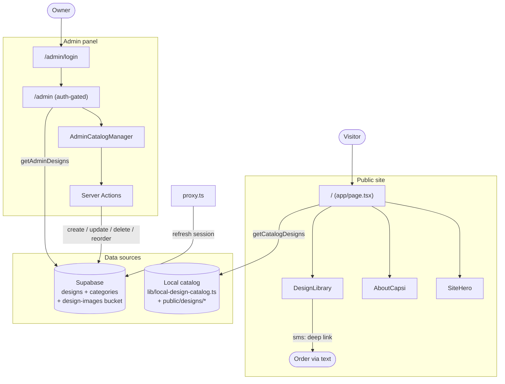

# Capsy

A catalog site for handmade scrub caps. Customers browse fabric designs and tap a card to text an order — no cart, no checkout.

## Overview

Capsy is a single-product-line catalog built with Next.js. The public homepage showcases a scroll-driven hero, an "about" story, and a filterable design library where each card is an SMS deep link that prefills an order text. An auth-gated admin panel (Supabase-backed) lets the owner manage designs, upload images, and reorder the catalog inline.

## Table of Contents

- [Tech Stack](#tech-stack)
- [Architecture](#architecture)
- [Project Structure](#project-structure)
- [Getting Started](#getting-started)
- [Key Features](#key-features)
- [Environment Variables](#environment-variables)
- [Notes](#notes)

## Tech Stack

| Layer        | Technology                                      |
| ------------ | ----------------------------------------------- |
| Framework    | Next.js 16 (App Router, Turbopack), React 19    |
| Language     | TypeScript                                      |
| Styling      | Tailwind CSS v4, shadcn/ui, Radix UI            |
| Theming      | next-themes                                     |
| Backend/Auth | Supabase (`@supabase/ssr`), Postgres + Storage  |
| Icons        | lucide-react                                    |
| Deploy       | Vercel                                          |

## Architecture

The public catalog and the admin panel use **two separate data sources**: the homepage renders a static catalog generated from local image files, while the admin panel reads and writes the Supabase `designs` table.



## Project Structure

```
.
├── app/
│   ├── page.tsx              # Public homepage (hero + about + library)
│   ├── layout.tsx            # Root layout, fonts, ThemeProvider
│   ├── globals.css           # Tailwind + custom animations
│   └── admin/
│       ├── page.tsx          # Auth-gated inline catalog editor
│       ├── login/page.tsx    # Admin sign-in
│       └── actions.ts        # Server actions (auth, CRUD, image upload)
├── components/
│   ├── site-hero.tsx         # Scroll-driven hero image swap
│   ├── about-capsi.tsx       # Scroll parallax about section
│   ├── design-library.tsx    # Category filter + SMS-to-order cards
│   ├── admin-catalog-manager.tsx
│   ├── theme-provider.tsx
│   └── ui/button.tsx         # shadcn/ui
├── lib/
│   ├── designs.ts            # Data access (public local + admin Supabase)
│   ├── design-shared.ts      # CatalogDesign type, default categories
│   ├── local-design-catalog.ts  # Static catalog from /public/designs
│   └── supabase/             # client, server, proxy, env helpers
├── supabase/
│   └── schema.sql            # Tables, RLS policies, storage bucket, seeds
├── public/designs/           # Local catalog images (8 categories)
└── proxy.ts                  # Next 16 proxy: Supabase session refresh
```

## Getting Started

```bash
# Install dependencies
npm install

# Configure environment (see below)
cp .env.example .env.local

# Run the dev server
npm run dev
```

The public site runs without any configuration (it uses the local catalog). The admin panel at `/admin` requires Supabase — apply `supabase/schema.sql` to your Supabase project and create an auth user to sign in.

### Scripts

| Command             | Description                    |
| ------------------- | ------------------------------ |
| `npm run dev`       | Start dev server (Turbopack)   |
| `npm run build`     | Production build               |
| `npm run start`     | Serve production build         |
| `npm run lint`      | Run ESLint                     |
| `npm run format`    | Format with Prettier           |
| `npm run typecheck` | Type-check with `tsc --noEmit` |

## Key Features

- Scroll-driven hero with sequential image swapping
- Filterable design library by category
- Order-by-text: each design card opens an SMS draft prefilled with the design name
- Auth-gated admin with inline catalog editing, drag-to-reorder, and image uploads
- Supabase Row Level Security: public read, authenticated write
- Light/dark theming via next-themes

## Environment Variables

| Variable                               | Required for | Description                   |
| -------------------------------------- | ------------ | ----------------------------- |
| `NEXT_PUBLIC_SUPABASE_URL`             | Admin        | Supabase project URL          |
| `NEXT_PUBLIC_SUPABASE_PUBLISHABLE_KEY` | Admin        | Supabase publishable/anon key |

`NEXT_PUBLIC_SUPABASE_ANON_KEY` is accepted as a fallback for the publishable key.

## Notes

- The public homepage and the admin panel are currently backed by **different data sources** (local files vs. Supabase). Edits made in admin do not appear on the public site until the two are reconciled.
- The `designs` table retains `material`, `fit`, and `availability` columns from an earlier richer product model; the current admin actions write empty strings for these.
